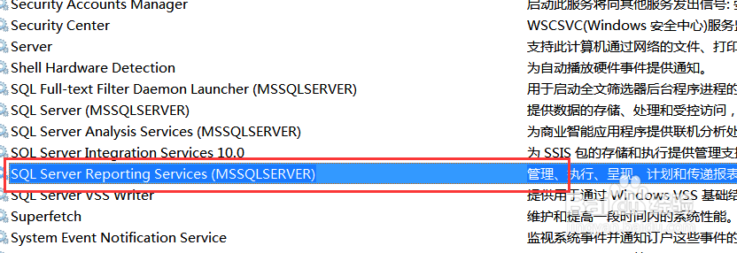

# Wamp使用出现的问题

## 1 Apache无法启动（wamp启动所有服务后图标红色变橙色）

**解决方法：**计算机右键->管理->服务和应用程序->服务->SQL Server Reporting Services(MSSQLSERVER)。停止服务后，启动Apache

## 2 127.0.0.1可以访问，localhost无法访问

在Apache的htttpd.conf中找到这么的一段

	#   onlineoffline tag - don't remove
	Order Deny,Allow
	Deny from all
	Allow from 127.0.0.1
	#   onlineoffline tag - don't remove
	Order Deny,Allow
	#Deny from all
	#Allow from 127.0.0.1
	Allow from all
## 3 127.0.0.1/phpmyadmin可以访问，localhost/phpmyadmin/无法访问

在wamp\alias下找到“phpmyadmin.conf”

	Order Deny,Allow
	Deny from all
	Allow from 127.0.0.1
修改为

	Order Deny,Allow
	#Deny from all
	#Allow from 127.0.0.1
	Allow from all

