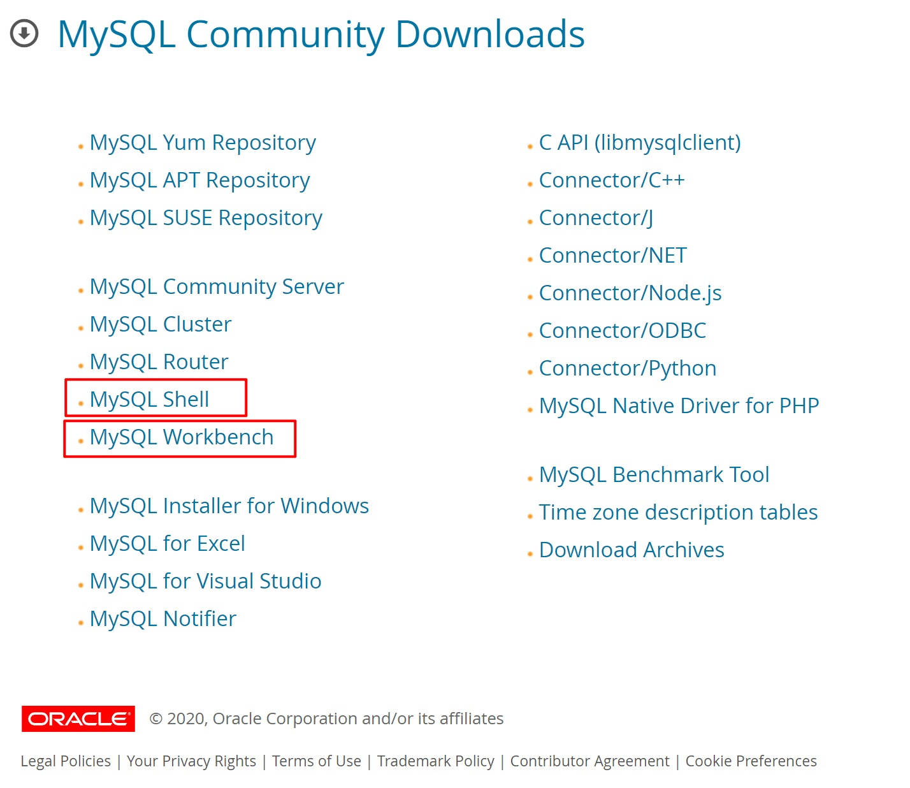
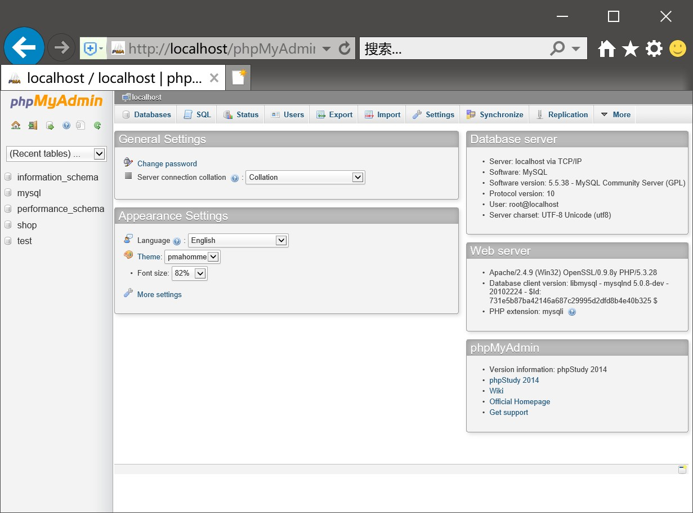
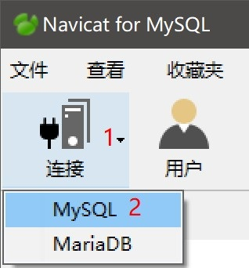

# 1 环境搭建

## 1.1 开发环境

数据库：**MySQL数据库**。

语言：**SQL**（结构化查询语言）

## 1.2 官方开发环境

- MySQL Shell是一个高级的MySQL命令行工具。
- MySQL Workbench是MySQL官方的可视化开发环境。

### 1.2.1 官方网址

https://dev.mysql.com/downloads/

### 1.2.2 镜像下载

地址：http://ftp.ntu.edu.tw/MySQL/Downloads/MySQLInstaller/

网页打开后，选择合适的软件版本。

### 1.2.3 开发环境安装

安装步骤请参考官方pdf。

https://www.mysql.com/content/download/id/249/

 [mysql_zh_wp_windows_installing.pdf](img\mysql_zh_wp_windows_installing.pdf) 

## 1.3 phpStudy（推荐）

phpStudy是一个PHP调试环境的程序集成包，集成了Apache、PHP、MySQL、phpMyAdmin等工具，是学习MySQL数据库、Web前端等课程的首选软件。

phpStudy自带的MySQL数据库用户名和密码，如下：

- 用户名：**root**
- 密码：**root**

### 1.3.1 phpStudy自带的界面开发环境phpMyAdmin（速度慢）

### 1.3.2 如何打开phpMyAdmin

### 1.3.3 phpStudy带的命令提示行

### 1.3.4 命令提示行打开方式

## 1.4 WampServer

二级MySQL考试应用软件，类似phpStudy。

# 2 可视化管理工具

Navicat是一个快速而简洁的图形化管理MySQL数据库的工具，它能够在任何地点有效地管理你的数据库。

## 2.1 建立连接

## 2.2 填写连接属性

## 2.3 双击打开连接

