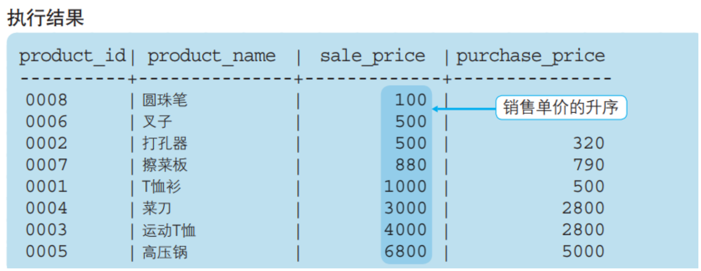
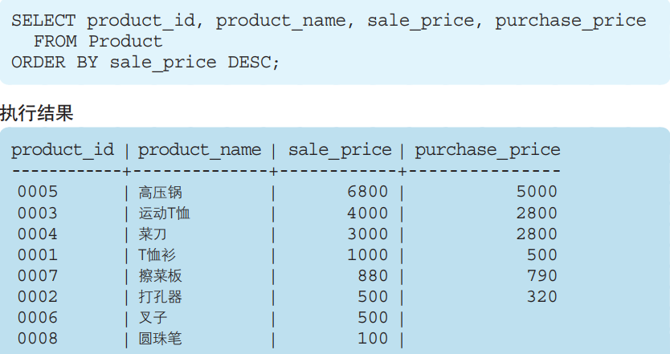
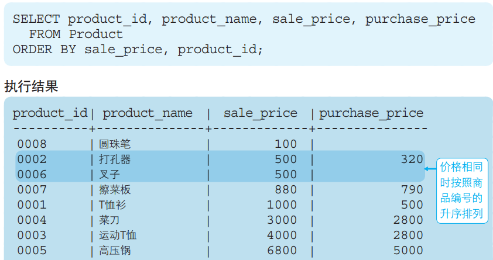
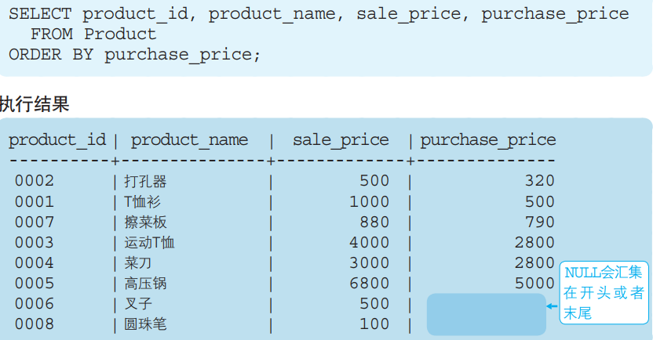

# 对查询结果进行排序(ORDER BY)

## 1 语法格式

```mysql
SELECT <列名1>,<列名2>,……,<列名n>
  FROM <表名>
 ORDER BY 排序基准1[ASC / DESC [默认 ASC]], [排序基准2][ASC / DESC [默认 ASC]],……
```

ASC 和 DESC 是 ascendent（上升的）和 descendent（下降的）这两个单词的缩写。

## **2 书写顺序**

 1.` SELECT 子句 `→ 2. `FROM 子句` → 3. `WHERE 子句` → 4. `GROUP BY 子句` → 5. `HAVING 子句` → 6. `ORDER BY 子句`

## 3 升序ASC，默认值（可不写）

例如按照销售单价由低到高（升序）进行排列

```mysql
SELECT product_id,product_name,sale_price,purchase_price 
  FROM product 
 ORDER BY sale_price ASC;
```



不论何种情况，ORDER BY 子句都需要写在 SELECT 语句的末尾。这 是因为对数据行进行排序的操作必须在结果即将返回时执行。ORDER BY 子句中书写的列名称为排序键。

## 4 降序DESC

按照销售单价由高到低（**降序**）进行排列



由于 ASC 和 DESC 这两个关键字是以列为单位指定的，因此可以 同时指定一个列为升序，指定其他列为降序。


## 5 指定多个排序键

由于<font color = green size = +2> ASC 和 DESC 这两个关键字是以列为单位</font>>指定的，因此<font color = green size = +1>可以同时指定一个列为升序，指定其他列为降序</font>>。

例题：按照销售单价和商品编号的升序进行排序



## **6 NULL的顺序**

按照进货单价的升序进行排列



排序键中包含NULL时，会在开头或末尾进行汇总。究竟是**在开头显示还是在末尾显示，并没有特殊规定**。