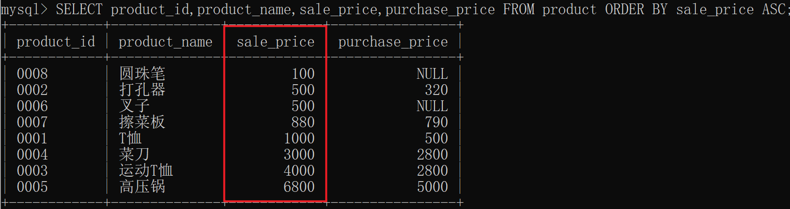
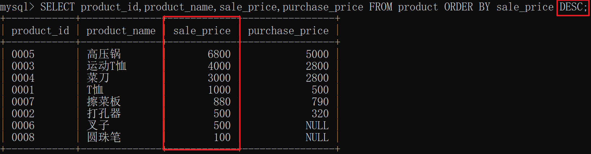
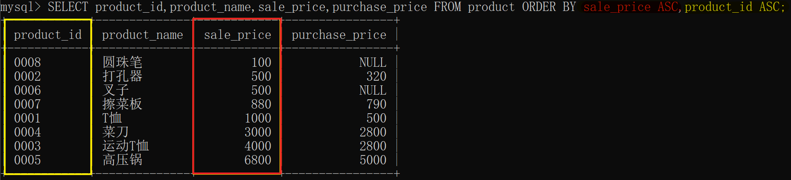
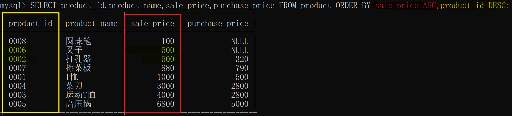
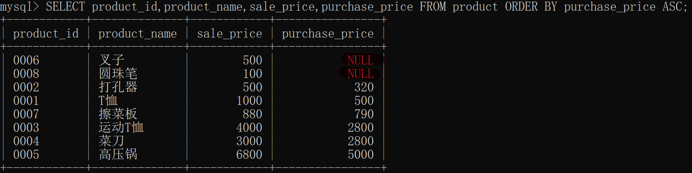
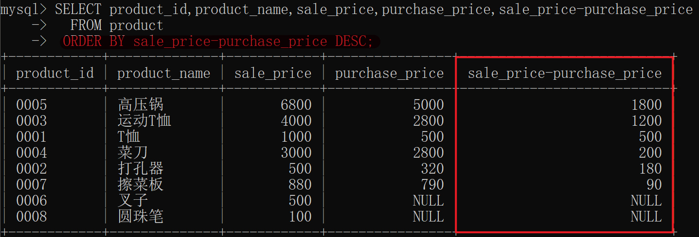

# 对查询结果进行排序(ORDER BY)

## 1 语法格式

```mysql
SELECT <列名1>,<列名2>,……,<列名n>
  FROM <表名>
 ORDER BY field1 [ASC [DESC][默认 ASC]], [field2...] [ASC [DESC][默认 ASC]]
```

ASC 和 DESC 是 ascendent（上升的）和 descendent（下降的）这两个单词的缩写。

## **2 书写、执行顺序**

2.1 书写顺序

 1.`SELECT子句   `→ 2. ` FROM子句` → 3. `WHERE子句 ` → 4. `GROUP BY 子句` → 5. ` HAVING子句` → 6. ` ORDER BY 子句`

2.2 执行顺序

 1.`   FROM子句`→ 2. ` WHERE子句` → 3. ` GROUP BY 子句` → 4. ` HAVING子句` → 5. ` SELECT子句` → 6. ` ORDER BY 子句`

## 3 升序ASC

例题：按照销售单价由低到高（升序）进行排序，显示商品编号、商品名称、售价和进价。

```mysql
SELECT product_id,product_name,sale_price,purchase_price FROM product ORDER BY sale_price ASC;
```

结果：



不论何种情况，ORDER BY 子句都需要写在 SELECT 语句的末尾。这 是因为对数据行进行排序的操作必须在结果即将返回时执行。ORDER BY 子句中书写的列名称为排序键。

## 4 降序DESC

例题：按照销售单价由高到低（**降序**）进行排列，显示商品编号、商品名称、售价和进价。

```mysql
SELECT product_id,product_name,sale_price,purchase_price FROM product ORDER BY sale_price DESC;
```

结果：



## 5 指定多个排序键

由于<font color = green size = +2> ASC 和 DESC 这两个关键字是以列为单位</font>指定的，因此<font color = green size = +1>可以同时指定一个列为升序，指定其他列为降序</font>。

例题：按照销售单价和商品编号的升序进行排序，显示商品编号、商品名称、售价和进价。

```mysql
SELECT product_id,product_name,sale_price,purchase_price FROM product ORDER BY sale_price ASC,product_id ASC;
```

结果：



例题：按照销售单价升序和商品编号进行降序排序，显示商品编号、商品名称、售价和进价。

```mysql
SELECT product_id,product_name,sale_price,purchase_price FROM product ORDER BY sale_price ASC,product_id DESC;
```

结果：



## **6 NULL的顺序**

例题：按照进货单价的升序进行排列，显示商品编号、商品名称、售价和进价。

```mysql
SELECT product_id,product_name,sale_price,purchase_price FROM product ORDER BY purchase_price ASC;
```

结果：



排序键中包含NULL时，会在开头或末尾进行汇总。究竟是**在开头显示还是在末尾显示，并没有特殊规定**。

## 7 可以以表达式排序

例题：按照product表中商品利润进行降序排列，显示商品编号、商品名称、售价、进价和利润。

分析：

1 显示**商品编号、商品名称、售价、进价和利润**

```MYSQL
SELECT product_id,product_name,sale_price,purchase_price,sale_price-purchase_price
```

2 商品利润进行降序排列

```mysql
ORDER BY sale_price-purchase_price DESC
```

代码：

```mysql
SELECT product_id,product_name,sale_price,purchase_price,sale_price-purchase_price 
  FROM product
 ORDER BY sale_price-purchase_price DESC;
```

结果：

