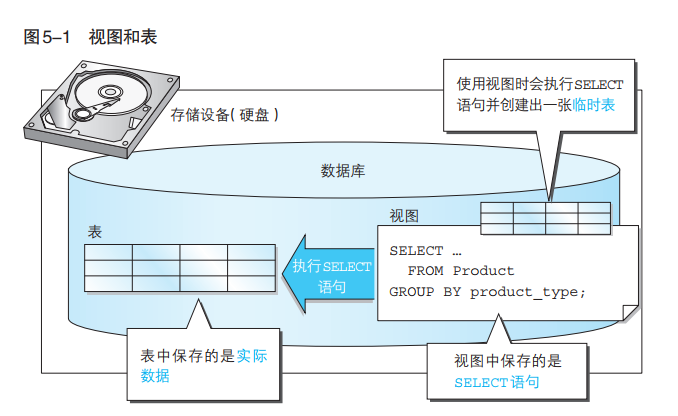
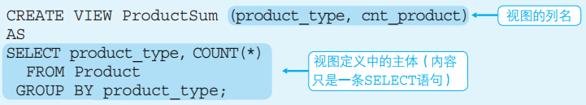
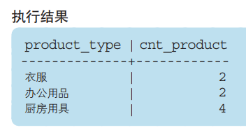
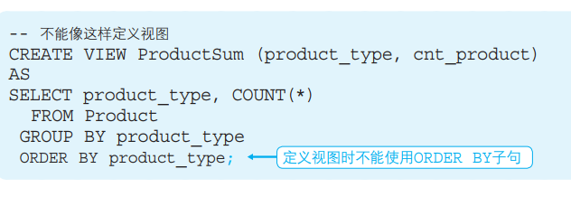
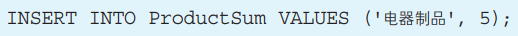
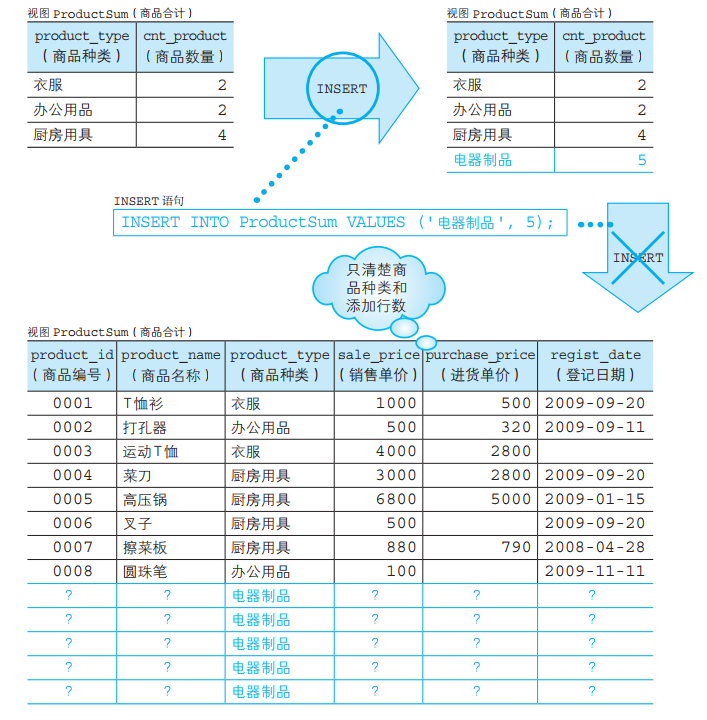
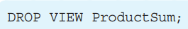

# 1  视图

## 1.1 概念

<font color = red size = +2>**视图**</font>是指计算机数据库中的视图，<font color = red size = +2><u>是一个虚拟表</u></font>，其内容由查询结果定义。同真实的表一样，视图包含一系列带有名称的列和行数据。<font color = green size = +1><u>视图中，没有保存实际的数据，保存的是SELECT语句</u></font>。行和列数据来自由定义视图的查询所引用的表，并且在引用视图时动态生成。

## 1.2 视图和表的不同



## 1.3 视图的优点

1. 第一点是由于视图**无需保存数据，因此可以节省存储设备的容量** 
2. 第二个优点就是可以将频繁使用的 SELECT 语句保存成视图，这样就**不用每次都重新书写**了。创建好视图 之 后， 只需在 SELECT 语句中进行调用，就可以方便地得到想要的结果了。特别是在进行汇总以及复杂的 查询条件导致 SELECT 语句非常庞大时，使用视图可以大大提高效率。


# 2 视图的创建

## 2.1 创建视图的语法格式

```mysql
CREATE VIEW 视图名称 [(<视图的列名1>,<视图的列名2>,……)]
 AS
 <SELECT语句>;
```

说明：

1. SELECT 语句需要书写在<font color = red> `AS` </font>关键字之后。
2. <font color = green> **SELECT 语句中列的排列顺序**和**视图中列的排列顺序相同**</font>，SELECT 语句中的第 1 列就是视图中的 第 1 列，SELECT 语句中的第 2 列就是视图中的第 2 列，以此类推。
3. 视图的<font color = red> **列名**</font>在<font color = red>视图名称之后的列表`(<视图的列名1>,<视图的列名2>,……)`中定义</font>。


## 2.2 **例题**

以**product表**为基础表，创建**视图ProductSum**。




# 3 视图的查询

视图的操作和表的操作基本一样（视图是一个虚拟的表）。

 查看视图语法： 

```mysql
SELECT 显示的列 FROM VIEWNAME;
```

 例如查看Productnum视图中的数据




说明：

通过上述视图 ProductSum 定义的主体（SELECT 语句）我们可 以看出，该视图将根据商品种类（product_type）汇总的商品数量 （cnt_product）作为结果保存了起来。这样如果大家在工作中需要 频 繁进行汇总时，就不用每次都使用 GROUP BY 和 COUNT 函数写 SELECT 语句来从 Product 表中取得数据了。创建出视图之后，就可以通过非常简单的 SELECT 语句，随时得到想要的汇总结果。

# 4 视图的限制

1. ## <font color = red>定义视图时不能使用ORDER BY子句</font>

然之前我们说过在定义视图时可以使用任何 SELECT 语句，但其 实有一种情况例外，那就是不能使用 ORDER BY 子句，因此下述视图定 义语句是错误的。



2. ## 为了成功对视图进行更新，视图的限定条件

之前我们说过，在 SELECT 语句中视图可以和表一样使用。那么， 对于 **INSERT、DELETE、UPDATE** 这类更新语句（更新数据的 SQL） 来说，会怎么样呢？

标准SQL中有这样的规定：**如果定义视图的SELECT语句能够满足某些条件，那么这个视图就可以被更新。**

条件如下：

① SELECT 子句中**未使用 DISTINCT**

② FROM 子句中**只有一张表**

③ 未使用 **GROUP BY 子句**

④ 未使用 **HAVING 子句**

⑤ 未使用聚合函数

:information_desk_person:**简单来说：**

<font color = red>不符合以上条件的视图，在使用视图来保存原表的汇总结果时，是**无法判断如何将视图的更改反映到原表中**的。</font>


例如，对 ProductSum 视图执行如下 INSERT 语句。



上述 INSERT 语句会发生错误。这是因为视图 ProductSum 是通过 GROUP BY 子句对原表进行汇总而得到的。为什么通过汇总得到的视图不能进行更新呢？无法保证数据的一致性。



结论：

视图和表需要同时进行更新，因此通过汇总得到的视图无法进行更新。


# 5 视图的修改

视图的修改（**ALTER** VIEW ）和视图的创建（**CREATE** VIEW ）语法格式类似。

视图的修改（ALTER VIEW ）语法格式：

```MYSQL
ALTER VIEW 视图名称 [(<视图的列名1>,<视图的列名2>,……)]
 AS
 <SELECT语句>;
```


# 6 删除视图

**语法格式：**

****

例如，想要删除视图 ProductSum 时，就可以使用下列代码清单中 的 SQL 语句。

****