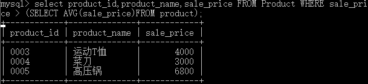
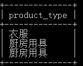
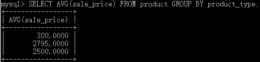
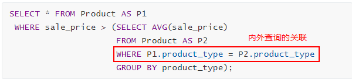
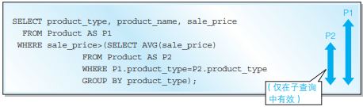
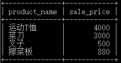

# 1 子查询

## 1.1 概念

<font color = red> **子查询**</font>也称<font color = green face = 隶书 size = +2><u>嵌套查询</u></font>，是<font color = green>将一个或多个查询语句嵌套在另一个语句中</font>。其内容一般包含在圆括号中，可以用在<font color = blue>**含有表达式**</font>的任何位置，例如在select、insert、update以及delete语句中的where或HAVING子句内。

## 1.2 例程

```MYSQL
SELECT product_type,cnt_product 
FROM (SELECT product_type,COUNT(*) AS cnt_product 
       FROM product 
      GROUP BY product_type) AS ProductSum;
```

**解析**

1. 执行<font color = blue>SELECT product_type,COUNT(*) AS cnt_product FROM Product GROUP BY product_type</font>。执行结果为一个表。
2. <font color = blue>（…）AS ProductSum</font>；将执行的结果（表）命名为ProductSum。
3. 执行 <font color = blue>SELECT product_type, cnt_product FROM ProductSum</font>;

## 1.3 执行顺序

首先执行<font color = green>**内层查询**</font>或<font color = green>**子查询**</font>，然后执行<font color = green>**外层查询**</font>或者<font color = green>**父查询**</font>


# 2 带比较运算符的子查询（标量子查询）

## 2.1 概念

<font color = red size = +2>**标量子查询**</font>是指<font color = green>子查询返回的是**单一值的**[**标量**](http://ciyu.cihai123.com/c/40106.html)</font>，如一个数字或一个字符串。

## 2.2 用途

与<font color = red>**比较运算符**</font>共同使用。常用在在标量子查询基础上需要再次查询的语句上。

=（等于）、> （大于）、< （小于）、>= （大于等于）、<= （小于等于）、<> （不等于）常用、[!=（不等于）](https://www.runoob.com/mysql/mysql-operator.html)

## 2.3 例程

 [CreateTableProduct.sql](img\CreateTableProduct.sql) 

**举例**

从product表中查询出销售单价高于平均销售单价的商品的编号、名称、售价。

**思考**

1. 显示的内容(SELECT) -> 商品的编号(product_id)、名称(product_name)、售价(sale_price) -> SELECT product_id,product_name,sale_price
2. 从表product -> FROM product
3. 条件：<font color = red>销售单价高于平均销售单价</font> -> <font color = green>WHERE sale_price > AVG(sale_price )  </font> :boom: 正确吗:question::question::question:

```MYSQL
SELECT product_id,product_name,sale_price 
  FROM product 
 WHERE sale_price > AVG(sale_price);
```

:exclamation: <u>只有SELECT子句、HAVING子句、ORDER BY子句可以使用聚合函数。</u>


:question:如何得出**平均销售单价？**

```MYSQL
SELECT AVG(sale_price) FROM Product;
```


将上步代码更改为：

```mysql
SELECT product_id,product_name,sale_price 
  FROM product 
 WHERE sale_price > (SELECT AVG(sale_price) FROM Product);
```

等效于

```mysql
SELECT product_id,product_name,sale_price 
  FROM product 
 WHERE sale_price > (2097.5);
```

执行结果




# 3 带IN关键字的子查询

## 3.1 带IN关键字的子查询和带比较运算符的子查询区别

- 带比较运算符的子查询是标量子查询，结果只返回<font color = red size = +1>**一个标量值**</font>。使用<font color = green size = +2>**比较运算符**</font>
- 带IN关键字的子查询返回结果是**<font color = red size = +1>集合</font>**。<u><font color = green size = +2>**在集合内用IN，不在用NOT IN**</font></u>。

## 3.2 例程

**举例**

从product表中查询出和销售单价高于平均销售单价的商品同等类型的商品名称和价格。

**思考**

1. 显示的内容(SELECT) -> 商品名称(product_name)、售价(sale_price) -> SELECT product_name,sale_price
2. 从表product -> FROM product
3. 条件：<font color = red>销售单价高于平均销售单价</font>的商品**同等类型**:question:如何获得


```MYSQL
SELECT product_type FROM product WHERE sale_price > (SELECT AVG(sale_price) FROM Product);
```

**执行结果**




:heavy_exclamation_mark: 比较运算符只能和一个值进行运算。

|  值  |              集合中的值              |       集合       |
| :--: | :----------------------------------: | :--------------: |
|  =   |    = ANY（等于集合内任意一个值）     | IN（值在集合内） |
|  <>  | <> ALL（和集合内任意一个值都不相等） |      NOT IN      |

**代码：**

```mysql
SELECT product_name,sale_price
  FROM product
 WHERE product_type IN (SELECT product_type FROM product WHERE sale_price > (SELECT AVG(sale_price) FROM product));
```
等效于

```mysql
SELECT product_name,sale_price
  FROM product
 WHERE product_type = ANY (SELECT product_type FROM product WHERE sale_price > (SELECT AVG(sale_price) FROM product));
```

**运行结果**


# 4 关联子查询

## **例程**

**选取例程出各商品种类中高于该商品种类的平均销售单价的商品。**


**思考：**

1 求该**商品种类**的**平均销售单价**

```mysql
SELECT AVG(sale_price) FROM product GROUP BY product_type;
```




2 **各商品种类**中**高于该商品种类的平均销售单价的商品**

```mysql
SELECT * FROM product WHERE sale_price > (SELECT AVG(sale_price) FROM product GROUP BY product_type);
```

但由于第1步中，`SELECT AVG(sale_price) FROM product GROUP BY product_type`**结果为多个，不能使用比较运算符**。详见带比较运算符的子查询。

为了解决以上问题，引入关联，形成**关联子查询**。

3 思考1和2的关系是**种类相同**。



其中，P1、P2为表Product的别名。以“**< 表名 >.< 列名 >**”的形式记述**指定表的指定列**。

**代码：**

```MYSQL
SELECT * FROM product AS p1 
 WHERE sale_price > (SELECT AVG(sale_price) 
                     FROM product AS p2 
                     WHERE p1.product_type = p2.product_type 
                     GROUP BY product_type);
```

添加阅读：P1和P2的有效范围




# 5 带EXISTS关键字的子查询

<font color = red>语法较难，酌情了解。EXISTS关键字基本可以使用IN/NOT IN来代替。</font>

## EXISTS谓词的使用方法

:exclamation:<font color = blue>**谓词EXISTS** </font>的作用就是<font color = red size = +2 >“判断是否存在满足某种条件的记录”</font>。<font color = green size = +1> 如果存在这样的记录就返回真（TRUE），如果不存在就返回假（FALSE）</font>。

EXISTS 只需要在右侧书写 1 个参数，该参数通常都会是一个子查询。

## 例程

选取出**大阪店** **在售商品**的**商品名称和售价**。

```mysql
SELECT product_name,sale_price
 FROM product AS P
 WHERE EXISTS (SELECT * 
               FROM ShopProduct AS SP 
               WHERE SP.shop_name = '大阪' AND SP.product_id = P.product_id);
```

**执行结果**：



**执行过程**：

<font color = green>将外查询表的每一行，代入内查询作为检验，</font><font color = red size = +2 >如果内查询返回的结果取非空值，则EXISTS子句返回TRUE，</font><font color = green size = +2 >这一行行可作为外查询的结果行，否则不能作为结果。</font>


以上代码可以使用IN来代替

```mysql
SELECT product_name,sale_price
 FROM product 
 WHERE product_id IN (SELECT product_id 
                      FROM ShopProduct 
                      WHERE shop_name = '大阪');
```

