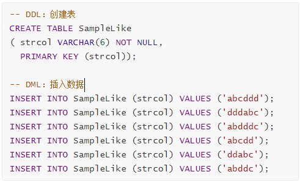
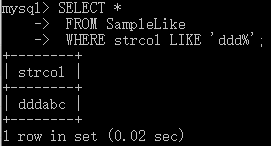

# 函数功能

函数可以帮助用户更加方便地处理表中的数据。

## 函数的种类

- **算术函数**（用来进行数值计算的函数） 

- **字符串函数**（用来进行字符串操作的函数） 

- **日期函数**（用来进行日期操作的函数）

- **转换函数**（用来转换数据类型和值的函数） 

- **聚合函数**（用来进行数据聚合的函数）包含 COUNT、SUM、AVG、MAX、MIN 5 种

   

例程使用资源

[CreateTableSampleMath.sql](img\CreateTableSampleMath.sql) 


## 1 算术函数 

### 1.1 ABS 绝对值 

绝对值的计算方法就是：0 和正数的绝对值就是其本身，负数的绝对值就是去掉符号后的结果。

例程：计算m的绝对值，并输出m和绝对值


结果：


### 1.2 MOD 求余（SQL Server不支持）

语法：


例程：计算除法（n÷p）的余数


结果：


### 1.3 ROUND 四舍五入

ROUND 函数用来进行四舍五入操作。ROUND(59.5,0)结果为60，ROUND(59.4,0)结果为59。

语法：


例程：


结果：


## 2 字符串函数

例程使用资源

 [CreateTableSampleStr.sql](img\CreateTableSampleStr.sql) 


### 2.1 CONCAT 字符串的拼接

实现多个字符串的拼接。进行字符串拼接时，如果其中一个为 NULL，则结果为NULL。

语法：


例程：


> **MySQL不支持 || 字符串的拼接。[扩展阅读](https://dev.mysql.com/doc/refman/8.0/en/string-functions.html)**


### 2.2 LENGTH 字符串长度 

语法：


注意：SQL Server中无法使用

例程：

```MYSQL
SELECT str1,LENGTH(str1) AS len_str 
 FROM SampleStr;
```

结果：


### 2.3 LOWER 小写转换

LOWER 函数只能针对*英文字母*使用，将字符串中字符转换为小写字符。

例程：


结果：


### 2.4 UPPER 大写转换

UPPER 函数只能针对*英文字母*使用，将字符串中字符转换为大写字符。

例程：


结果：


### 2.5 REPLACE 字符串的替换

语法：


例程：


结果：


### 2.6 SUBSTRING 字符串的截取

语法：


例程：


结果：


## ★3 日期函数

### 3.1 CURREN2T_DATE 当前日期

例程：


结果：


### 3.2 CURRENT_TIME 当前时间

例程：


结果：


###  3.3 CURRENT_TIMESTAMP 当前日期和时间


例程：


结果：


# 谓词

## 概念 

<font color = red>返回值为"TRUE\FALSE\UNKNOWN"的函数。</font>

本节将会介绍以下谓词。

- <font color = red>★LIKE </font>
- BETWEEN
- IS NULL、IS NOT NULL 
- IN
- EXISTS

## ★LIKE谓词 模糊查询

使用LIKE进行字符串部分一致性检查(模糊查询)。

### 例程使用资源

 [CreateTableSampleLike.sql](img\CreateTableSampleLike.sql) 




模糊查询可能用到：

- 前方一致；
- 中间一致；
- 后方一致；

### 前方一致 

条件“ddd”查询出“**ddd**abc”

例程：



中间一致

条件“ddd”查询出“**ddd**abc”“abc**ddd**”“ab**dddc**”


例程：


### 后方一致

条件“ddd”查询出“abc**ddd**”


**通配符:**

**（1）％** **(半角百分号):表示任意个字符**

**（2）_ (下划线):表示单个字符**


## BETWEEN谓词 范围查询

例程：

查询Product表中 销售单价为100～1000日元的商品。

程序：


结果：


注意：BETWEEN 的特点就是结果中会包含 100 和 1000 这两个临界值。


## IS NULL、IS NOT NULL 判断是否为NULL


## IN、NOT IN 详见“带IN关键字的子查询”


## EXISTS 详见 “带EXISTS关键字的子查询”