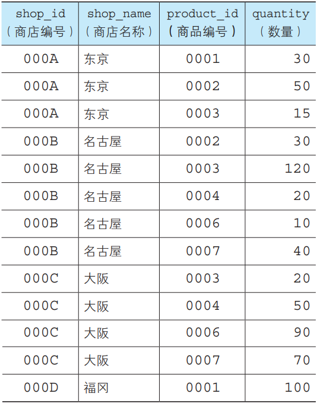

## 表的加法 UNION

例程需要表Product和Product2。

例程：

结果：

UNION运算如下图所示。**去掉了重复的记录**。

### UNION运算注意事项：

① 作为运算对象的记录的列数必须相同；

② 作为运算对象的记录中列的类型必须一致；

③ 可以使用任何SELECT语句，但ORDER BY子句只 能在最后使用一次；

### 包含重复行的集合运算 ALL选项

使用方法：UNION 后添加ALL关键字即可。

例程：

结果:

### 选取表中公共部分 INTERSECT

使用方法同UNION。将UNION替换为INTERSECT即可。

## 表的减法 EXCEPT

语法也与 UNION 相同。区别如下图所示。

# 联结(以列为单位)

上一节的**表的加减法**的特征就是以**行方向**为单位进行操作。

## 联结（JOIN）

**<u>无法从一个表中获得想要的数据时，需要从两个或者多个表的查询操作，称为连接查询。</u>**

注意：联结是在列的方向上进行。

**Product（商品）表**

**ShopProduct（商店商品）表**

**两表的列进行对比**

**经过对比发现：**

1. **商品编号两表都有**；
2. 其他列都只在一个表中出现。

**联结运算**就是以 **两表共有的列** 作为桥梁，将其他列汇集到一个结果中。

## 内联结 INNER JOIN

语法格式1：

语法格式2：

例程：

或者

结果：

别名非必需，但可以简化代码长度。

**注意：**

1. 使用INNER JOIN时，多表的联结条件使用ON子句。
2. 使用逗号时，联结条件写在WHERE子句中。
3. 且 ON 必须书写在 FROM 和 WHERE 之间。