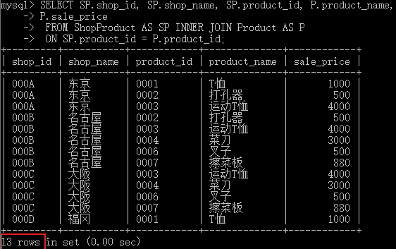
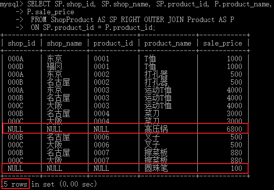
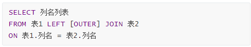
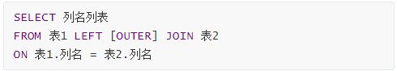
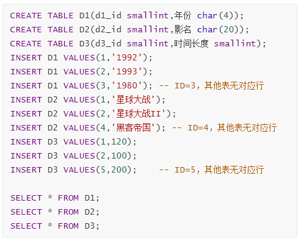
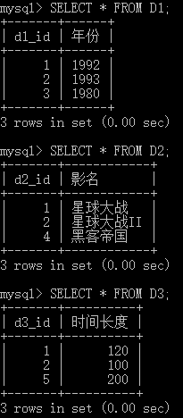
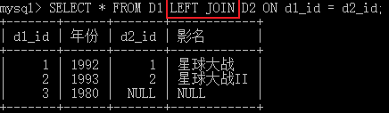
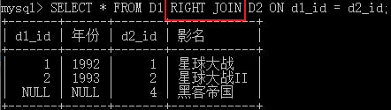

## 外联结 OUTER JOIN

**内联结**查询只返回**查询结果集合中符合联结条件和查询条件（即过滤条件）的行**。**外联结**可以返回**不满足联结条件**的记录。其他同内联结。

内联结

外联结

:question: 外联结保留数据以**哪个表**为基准？

## 外联结分为左外联结和右外联结

左联结的语法格式：

右联结的语法格式：

例程所需资源：

例程：

结果

例程：

结果

结论：

1. `表1 LEFT JOIN 表2` 以`LEFT JOIN`**左侧的**表为准
2. `表1 RIGHT JOIN 表2` 以`RIGHT JOIN`**右侧的**表为准