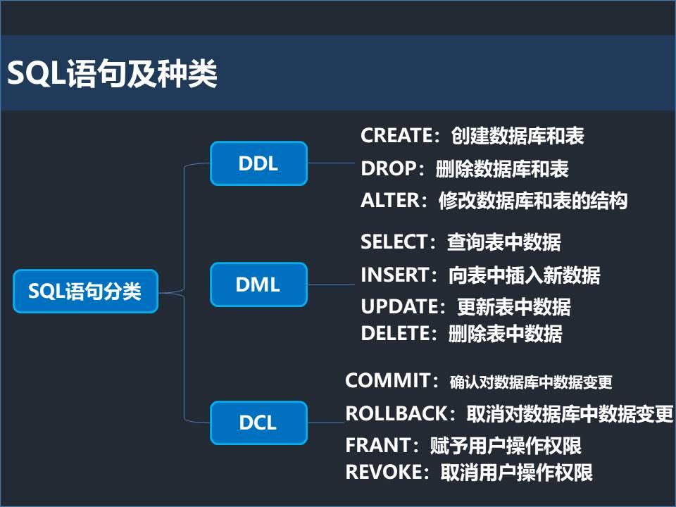
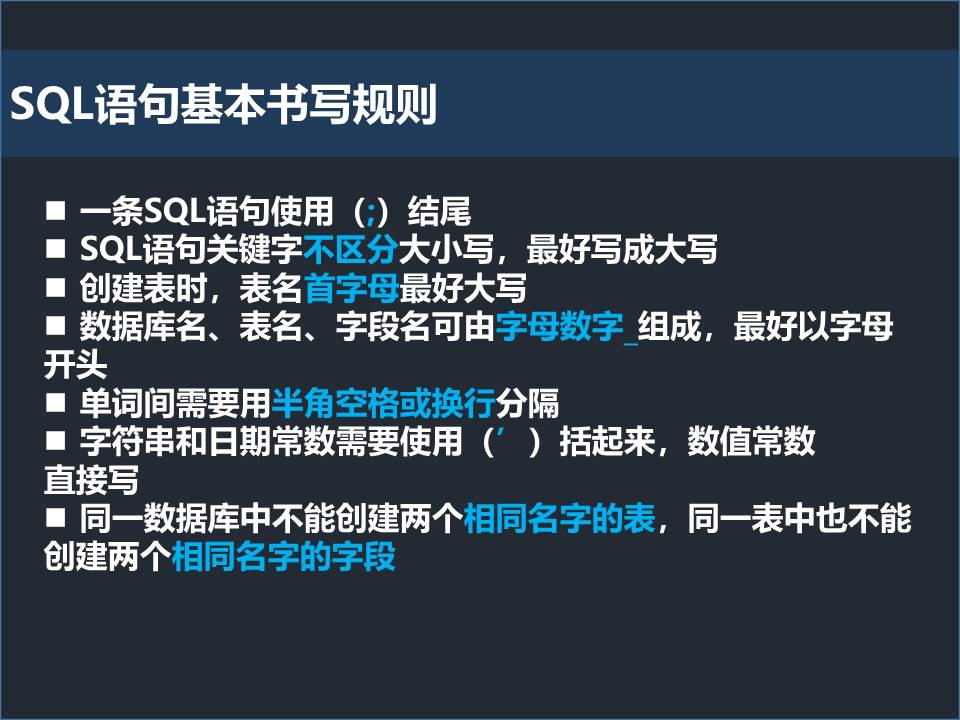
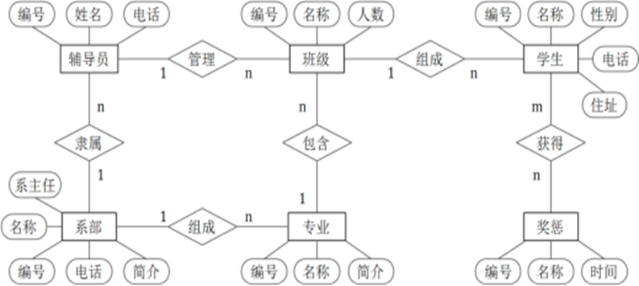
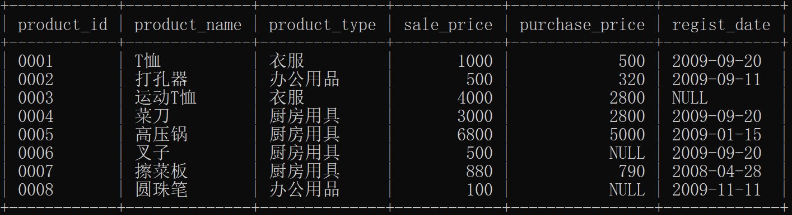

# 1 基本概念

## 1.1 数据（Data）
传统和狭义的理解，数据就是数字。
**数据定义**：数据是表述事物的**符号记录**。
数据有多种形式，可以是数字、字母、文字、特殊字符等组成的文本数据，也可以是图形、图像、动画、影音、声音、语言等多媒体数据。

计算机中，为了存储和处理客观事物，需要**抽象**出所关注的**事物特征**。

**数据本身并不能完全表达其内容，需要经过解释**，数据和数据的语义是不可分的。例如1.85可以是某物体的长度，也可以是某人的身高。

## 1.2 数据库（Database，DB）

数据库是长期存储在计算机内的、有组织的、可共享的**数据集合**。

## 1.3 数据库管理系统（Database Management System, DBMS）

**DBMS**是位于**操作系统**与**用户之间**的一层数据管理**软件**。主要功能包括**数据定义**、**数据操纵**、数据库建立和维护、数据库运行管理等。

## 1.4 数据库系统（Database System，DBS）

数据库系统是指引入数据库技术的**计算机系统**。在不引起混淆的情况下，数据库系统简称为数据库。

## 1.5 SQL概要

国际标准化组织（ISO）为 SQL 制定了相应的标准，以此为基准的 SQL 称为**标准 SQL**。



### （1）数据定义（DDL）

DBMS提供**数据定义语言**（Data Definition Language，**DDL**）。数据定义语言主要用于对数据库及数据库中的各种对象进行**创建、删除、修改**等操作。其中，数据库对象主要有表、默认约束、规则、视图触发器、存储过程等。

DDL主要包括：

- CREATE: 创建数据库或数据库对象；
- ALTER: 修改数据库或数据库对象；
- DROP: 删除数据库或数据库对象；

### （2）数据操纵（DML）

DBMS提供**数据操纵语言**（Data Manipulation Language，**DML**）。DML主要用于操纵数据库中各种对象。

DML主要包括：

- **SELECT**: 从表或者视图中检索数据，使用最频繁；
- **INSERT**: 用于将数据插入到表或视图中；
- **UPDATE**: 更改表或视图中的数据；
- **DELETE**: 删除表或视图的数据。

### SQL的基本书写规则



# 2 数据库系统的结构

数据库系统常见的结构有**客户/服务器**结构（Client/Server，**C/S**）和**浏览器/服务器**（Browser/Server，**B/S**）结构。


# 3 数据模型（Data Model）

数据库中的数据是有一定结构的，这种结构就是数据模型（Data Model）。

根据不同的应用目的，数据模型分为：概念模型、逻辑模型和物理模型。

## 3.1 概念模型（Conceptual Model）

在设计数据库时，用概念模型来抽象、表示现实世界的各种事物及其联系。最典型的概念模型就是**实体联系（Entity - Relationship，E-R）模型**。

### 3.1.1 实体（Entity）

客观存在并可相互区别的事物称为实体（Entity）。

### 3.1.2 属性（Attribute）

实体所具有的某方面的特性称为属性。

一个实体可以由多个属性描述。例如，学生具有学号、姓名、性别、出生日期等特性，也就是说学生具有学号、姓名、性别、出生日期等属性。每个学生是一个**实体**，所有学生构成一个**实体集**。

### 3.1.3 联系（Relationship）

现实世界中，事务内部的特性及各事物之间是**有关系的**，这些关系称为实体内部的联系及实体之间的**联系**。

### 3.1.4 实体集之间的联系

1. 一对一联系（1:1）
2. 一对多联系（1:N）
3. 多对多联系（M:N）

### 3.1.5 E-R图



- 实体：矩形表示
- 属性：椭圆形表示
- 联系：菱形表示，菱形框内写联系的名称，并用无向线将有关实体连接起来。

## 3.2 逻辑模型（Logical Model）

逻辑模型是具体的DBMS所支持的数据模型。主要的逻辑模型有层次模型（Hierarchical Model）、网状模型（Network Model）、**关系模型（Relational Model）**、面向对象模型（Object Oriented Model）等。这类模型更关注机器的世界，是数据库系统的核心和基础，各种DBMS系统都是基于某种数据模型的，或者说是支持某种数据模型。

本课程主要介绍关系模型数据库。

## 3.3 物理模型

物理模型是用于描述数据在存储介质上的组织结构。一般对用户屏蔽，用户不必了解。


# 4 关系数据库的基本概念

关系数据库是目前应用最广泛的数据库。

## 4.1 基本概念

**实体**和**实体间的联系**，都可以用**关系**表示。关系的数据结构就是**二维表**。

表Product中的信息如下



### 1 表（Table）

表（Table）也称为**关系**，由**表名**、**列**、**数据行**组成。

**★重要，请注意：**

- 每个表有唯一的表名；
- 表中每一行数据描述一个实体或联系的基本信息；
- 数据库系统中，不使用中文作为表名、字段名；
- 命名要有意义，尽量短

表的结构称为关系模式。表Product的关系模式可以表示为

```mysql
Product(product_id,product_name,product_type,sale_price,purchase_price,regist_date)
```

表Product的结构定义

|   含义   |     字段名     |   数据类型   | 宽度 |
| :------: | :------------: | :----------: | :--: |
| 商品编码 |   product_id   |    字符型    |  4   |
| 商品名称 |  product_name  | 可变长字符型 | 100  |
| 商品类型 |  product_type  | 可变长字符型 |  32  |
| 销售价格 |   sale_price   |    整数型    |      |
| 购买价格 | purchase_price |    整数型    |      |
| 注册时间 |  regist_date   |    日期型    |      |

### 2 列（Field）

表中的**列（Field）**也称作**字段**或**属性**。每一列都有一个名字，称为**字段名**、**属性名**、**列名**。

注意：

- 每一列表示实体的一个属性；
- 每一列具有相同的数据类型；
- 命名要有意义，尽量短

### 3 行（Row）

表中的数据是按行存储的。表中的**行（Row）**也称**记录（Record）**或者**元组（Tuple）**。表中有多少行就称为有多少个元组、记录。

### 4 主键（Primary Key）

**主键**（Primary Key）也称**码**。主键是表中**能唯一确定一个元组**的**属性**或者**属性组**。一般学生的学号、身份证号、商品编码等等都可以作为主键。

### 5 外键（Foreign Key）

如果表中的一个字段**不是本表的主键**，而是**另外一个表的主键**，则该字段称为**外键**。

### 6 域（Domain）

域（Domain）表示属性的取值范围。

## 4.2 关系数据库具有下列基本性质

1. 每一列都必须是不可再分的数据项；
2. 表的任意两个元组不能完全相同；
3. 表的每一列都是同一数据类型，而且列的值来自相同的域；
4. 列名不能相同；
5. 列的顺序可以任意交换，行的顺序也可以任意交换。

