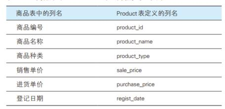
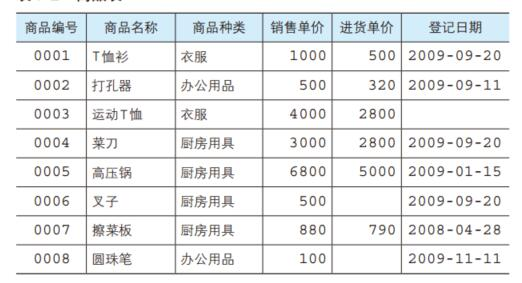

# 1 数据库的创建

创建数据表之前，需创建数据库来存储数据表

* 创建数据库的基本语法

```mysql
CREATE DATABASE 数据库名;
```

例程：

```mysql
#创建数据库shop
CREATE DATABASE shop;
```

* 创建数据库的同时，将编码设置为utf-8

```mysql
CREATE DATABASE shop CHARACTER SET utf8;
```

* 使用数据库

```mysql
USE 数据库名;
```

# 2 数据表的创建

* 创建数据表的基本语法

```mysql
CREATE TABLE 表名(
    列名1 数据类型 该列所需约束,
    列名2 数据类型 该列所需约束,
    列名3 数据类型 该列所需约束,
    ...
);
```

创建数据表时，每一列的数据类型（后述）是必须要制定的。

* 创建数据表时，查看数据表是否存在

```mysql
CREATE TABLE IF NOT EXISTS 表名(
    列名1 数据类型 该列所需约束,
    列名2 数据类型 该列所需约束,
    列名3 数据类型 该列所需约束,
    ...
);
```

* 创建数据表时，设置ENGINE 设置存储引擎，CHARSET 设置编码

```mysql
CREATE TABLE 表名(
    列名1 数据类型 该列所需约束,
    列名2 数据类型 该列所需约束,
    列名3 数据类型 该列所需约束,
    ...
)ENGINE=InnoDB DEFAULT CHARSET=utf8;
```

# 3 数据类型设置

### 1.数据类型概述

​       数据类型（data type）是指系统中所允许的数据的类型。数据库中的每个列都应该有适当的数据类型，用于限制或允许该列中存储的数据。例如，列中存储的为数字，则相应的数据类型应该为数值类型。使用数据类型有助于对数据进行正确排序，并在优化磁盘使用方面起着重要的作用。因此，在创建表时必须为每个列设置正确的数据类型及可能的长度。

### 2.常用数据类型

* 整数

INTEGER，int型。用来指定存储整数的列的数据类型（数字型），不能存储小数。int占4个字节，1个字节8位，也就是4 * 8 = 32，默认10位，可以表示的数字是0~2<sup>32</sup>(无符号）（有符号：-2<sup>31~2<sup>32</sup>）。

* 浮点数

float，用来指定存储小数的列的数据类型（数字型），不能存储整数。float占4个字节，1个字节8位，也就是4 * 8 = 32。*float(10,2)，10代表整数部分和小数部分加起来总共10位，2代表有两位小数。*

* 字符

1.CHAR型，是CHARACTER的缩写。用来指定存储字符串的列的数据类型，字符串以定长字符串的形式存储在被指定为CHAR型的列中。所谓定长字符串，就是当列中存储的字符串长度达不到最大长度时，使用半角空格进行补足。例如：CHAR(8) 类型的列中输入'abc'的时候，会以 'abc     '（abc 后面有 5 个半角空格）的形式保存起来。  

2.VARCHAR型，该数据类型的列是以可变长字符串的形式来保存字符串。例如：VARCHAR(8) 类型的列中输入字符串 'abc' 的时候，保存的就是字符串'abc'。  

* 日期

DATE，用来指定存储日期（年月日）的列的数据类型。

# 4 常用约束的设置

约束是除了数据类型外，对列中存储的数据进行限制或者追加条件的功能。

1. NOT NULL，表示该字段不能输入空白，也就是必须输入数据的约束（如果什么都不输入就会报错）
2. PRIMARY KEY (字段名)，将某字段设置为主键约束，键就是在指定特定数据时使用的列的组合，设置为主键的字段不能有重复数据。设置主键有两种方式：
   * 创建表时，直接在字段后 + PRIMARY KEY
   * 创建表时 ，在最后 + PRIMARY KEY (字段名)
3. <font color = "red">AUTO_INCREMENT</font>，定义字段为自增的属性，一般用于主键，数值会自动加1，避免主键出现重复数据。

# <font color = "red">练习：创建表名为Product的表</font>



```mysql
CREATE TABLE Product(
	product_id CHAR(4) NOT NULL PRIMARY KEY,
    product_name VARCHAR(100) NOT NULL,
    product_type VARCHAR(32) NOT NULL,
    sale_price INT,
    purchase_price INT,
    regist_date DATE,
    #PRIMARY KEY (product_id)
);
```

# 5 注释的书写方式

* 单行注释

注释内容写在 **#** 之后或  **--** 之后

* 多行注释

注释内容写在 **/*** 和 ***/** 之间

# 6 数据库和表的查看和删除

* 查看数据库和表

```mysql
#查看数据库
SHOW DATABASES;
#查看表
SHOW TABLES;
```

* 查表结构

```mysql
DESC 表名;
```

* 删除数据库的语法

```mysql
DROP DATABASE 数据库名;
```

* 删除表的语法

```mysql
DROP TABLE 表名;
```

不建议删除数据库和表，删除后将无法恢复，因此，在使用DROP时要慎重。

# 7 表定义的更新

有时将表创建好后，发现表名称定义错误、字段定义错误、少定义或多定义了一些字段，此时，无需将表删除再定义，更新表即可。

* 添加字段的语法

```mysql
ALTER TABLE 表名 ADD COLUMN 新字段名 数据类型 约束;
或者
ALTER TABLE 表名 ADD 新字段名 数据类型 约束;
```

```mysql
#例如：向Product表中添加product_name_pinyin字段
ALTER TABLE Product ADD COLUMN product_name_pinyin VARCHAR(100);
```

* 删除字段的语法

```mysql
ALTER TABLE 表名 DROP COLUMN 字段名;
或者
ALTER TABLE 表名 DROP 字段名;
```

```mysql
#例如：将Product表中的product_name_pinyin字段删除
ALTER TABLE Product DROP COLUMN product_name_pinyin;
```

* 改字段名语法

```mysql
ALTER TABLE 表名 CHANGE 原字段名 新字段名 数据类型;
```

* 改字段类型

```mysql
ALTER TABLE 表名 MODIFY 字段名 数据类型;
```

* 修改表名的基本语法

```mysql
RENAME TABLE 原表名 to 新表名;
#或者
ALTER TABLE 原表名 rename 新表名;
```

# 8 向表中插入数据

* 向每个字段都插入数据

```mysql
INSERT INTO 表名(字段1,字段2,字段3,..) VALUES(值1,值2,值3,...);
```

* 向每个字段独插入数据，在插入时可以省略表后的字段，但前提是values关键字后面的字段值数量必须与字段数量保持一致。

```mysql
INSERT INTO 表名 VALUES(值1,值2,值3,...);
```

* 向指定字段插入数据

```mysql
INSERT INTO 表名(字段3,字段6) VALUES(值3,值6);
```

* 赋值插入数据

```mysql
INSERT INTO 表名 SET 字段1=值1,字段2=值2,字段5=值5,...;
```

* 同时插入多条数据

```mysql
INSERT INTO 表名(字段1,字段2,字段3) 
VALUES(值1,值2,值3),(值1,值2,值3),(值1,值2,值3),(值1,值2,值3),(值1,值2,值3);
```

# <font color = "red">练习：创建下表，并填入数据</font>




```mysql
CREATE DATABASE shop CHARACTER SET utf8;
USE shop;
CREATE TABLE IF NOT EXISTS Product(
	product_id CHAR(4) NOT NULL,
    product_name VARCHAR(100) NOT NULL,
    product_type VARCHAR(32) NOT NULL,
    sale_price INT,
    purchase_price INT,
    regist_date DATE,
    PRIMARY KEY (product_id)
);
INSERT INTO Product VALUES('0001','T恤衫','衣服',1000,500,'2009-09-20'),('0002','打孔器','办公用品',500,320,'2009-09-11'),('0003','运动T恤','衣服',4000, 2800,NULL),('0004','菜刀','厨房用具',3000, 2800,'2009-09-20'),('0005','高压锅','厨房用具',6800,5000,'2009-01-15'),('0006','叉子','厨房用具',500, NULL,'2009-09-20'),('0007','擦菜板','厨房用具',880,790,'2008-04-28'),('0008','圆珠笔','办公用品',100,NULL,'2009-11-11');
```


