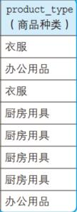

# SELECT语句基础

SELECT 语句是 SQL 语句中使用最多的最基本的 SQL 语句。

## ★1 列的查询

 **SELECT 语句语法格式**

```mysql
SELECT <列名>,…… FROM <表名>;
```
<列名>,……   **要显示的列名列表**

注意：

1. **查询出的列的顺序可以任意指定**
2. **查询多列时，需要将查询的字段用逗号进行分隔**
3. **查询所得结果中列的顺序和SELECT子句中的顺序相同**

## ★2 查询所有列（*）

```mysql
SELECT * FROM 表名;
```

## ★3 别名（AS）

* 使用关键字**AS**可为查询结果中的字段设定别名。其语法为

```mysql
SELECT 字段1,字段2 AS 别名2,... FROM 表名;
```

## 4 查询常数

当查询的字段表中不存在时，此字段会作为**常数**进行查询。**常用来显示特定的内容**。

```mysql
SELECT 常数1,常数2,常数3,... FROM 表名;
```

或者

```mysql
SELECT 常数1 AS 别名1,常数2 AS 别名2,常数3 AS 别名3,... FROM 表名;
```

## ★5 去除重复（DISTINCT）

想要去除查询结果中的重复值，可以使用**DISTINCT**实现，如**商品种类**存在重复值



希望查询结果中，商品种类字段只包含唯一值。

```mysql
SELECT DISTINCT product_type FROM Product; 
```

**对于一列中含有多个NULL时，NULL 也会被认为是重复值进行处理**

**若在多个查询字段中使用DISTINCT时，DISTINCT只能用在第一个字段之前**，并删除重复的行。

```mysql
SELECT DISTINCT product_type,regist_date FROM Product;
```

## ★6 条件查询（WHERE）

在数据查询过程中，通常是根据需求进行数据的筛选。SELECT语句通过**WHERE**子句来指定筛选条件。语法如下

```mysql
SELECT 要显示的字段 FROM 表名 WHERE 条件表达式
```

```mysql
-- 比如出product_type是 厨房用具 的数据
SELECT * FROM Product WHERE product_type = '厨房用具';
-- 筛选出product_type是 厨房用具 的商品名称
SELECT product_name FROM Product WHERE product_type = '厨房用具';
-- 筛选出售卖价格为4000的所有字段信息
SELECT * FROM Product WHERE sale_price = 4000;
```


