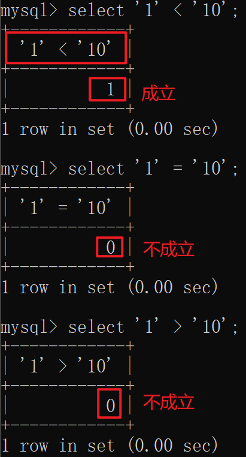

# 1 算数运算符

SQL语句可以使用表达式，可以使用常规的“+、-、*、/”算数运算符。

表product中的数据


**例题：请输出product表中，所有商品的名称、进价、售价和毛利。**

```mysql
SELECT product_name,sale_price,purchase_price,sale_price - purchase_price FROM product;
```

**结果：**


分析：

1. 结果输出的列名为**原列名**或者**运算表达式**，为了便于人们阅读，可以使用别名（AS）。
2. 任何与NULL做四则运算（+、-、*、/）的表达式结果都为NULL。


# 2 比较运算符

SQL语句可以使用比较运算符。


## 比较运算符可以对字符、数字和**日期**等几乎所有数据类型的列和值进行比较。

## 2.1 数字比较

例题：请选取出售价大于1000元的商品的所有信息。**

**分析：**

要显示的列		->	所有信息		->	SELECT *

从哪个表中表	->	product		->	FROM product

条件					->	售价大于1000	->	WHERE 售价 > 1000

查询使用的**语法格式：**

**SELECT**  要显示的列 **FROM** 哪个表中  **WHERE** 条件

**代码：**

```mysql
SELECT * FROM product WHERE sale_price > 1000;
```

**结果：**


## 2.2 日期的比较

**例题：请从表product中查询出2009年9月份的销售记录。**

分析：9月份 ->   2009年9月1日 <= regist_date <= 2009年9月30日

代码：

```mysql
SELECT * FROM product WHERE regist_date >= '2009-09-01' AND regist_date <= '2009-09-30';
```

结果：


## 2.3 字符的比较

字符串的不等比较（除了等于的比较）使用的规则和数字不同。

**'1' < '10' < '11' < '2' < '222' < '3'**



## 2.4 NULL的比较

只能使用 **IS NULL** 和**IS NOT NULL**运算符。

