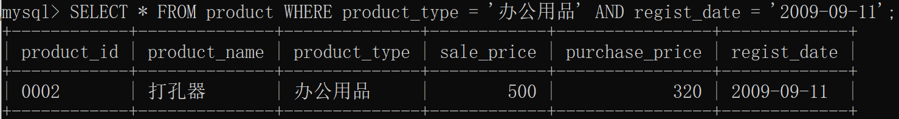
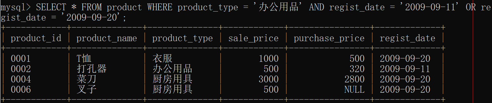

# 逻辑运算符


**例题1：从product表中，查询出“商品种类为办公用品”，并且“登记日期是 2009 年 9 月11日”的商品的所有记录。**


分析：

1 要显示的列有哪些 -> 所有的	->	SELECT *

2 从哪个表中	->	product	->	FROM product

3 条件	->	商品种类为办公用品		->WHERE	product_type = '办公用品'

​					且	登记日期为2009-09-11	->	regist_date = '2009-09-11'

代码：

```MYSQL
SELECT * FROM product WHERE product_type = '办公用品' AND regist_date = '2009-09-11';
```

结果：




**例题2：从product表中，查询出“商品种类为办公用品”，并且“登记日期是 2009 年 9 月11日或者 2009 年 9 月20日”的商品的所有记录。**

分析：

1 要显示的列有哪些 -> 所有的	->	SELECT *

2 从哪个表中	->	product	->	FROM product

3 条件	->	商品种类为办公用品		->WHERE	product_type = '办公用品'

​				并且		登记日期为2009-09-11	->	regist_date = '2009-09-11'

​				或者		登记日期为2009-09-20	->	regist_date = '2009-09-20'

代码：

```mysql
SELECT * FROM product WHERE product_type = '办公用品' AND regist_date = '2009-09-11' OR regist_date = '2009-09-20';
```

结果不是咱们想要的0002



**原因：**逻辑运算符的优先级问题。**要用英文小括号（）改变优先级**。

```mysql
SELECT * FROM product WHERE product_type = '办公用品' AND (regist_date = '2009-09-11' OR regist_date = '2009-09-20');
```


**含有不确定态的SQL三值逻辑**


**不确定态既不是真，也不是假**

