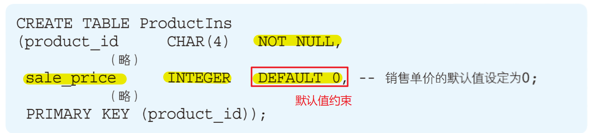
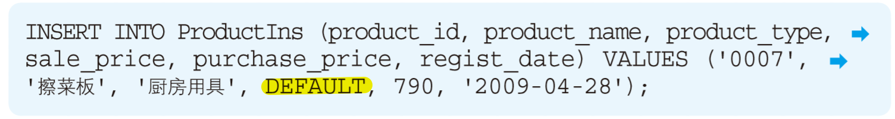
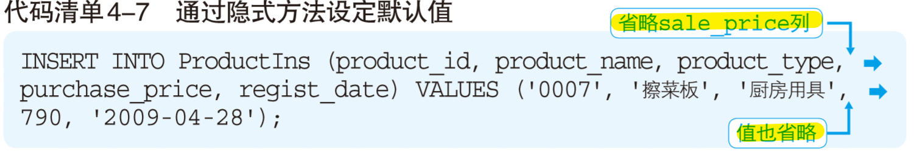
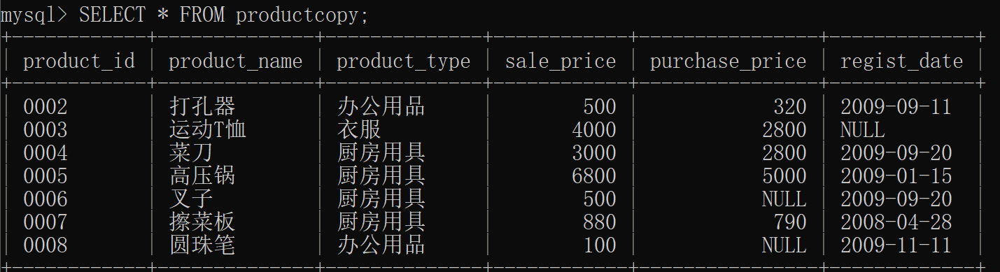
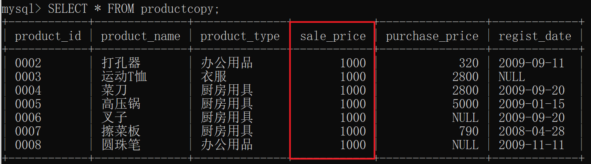
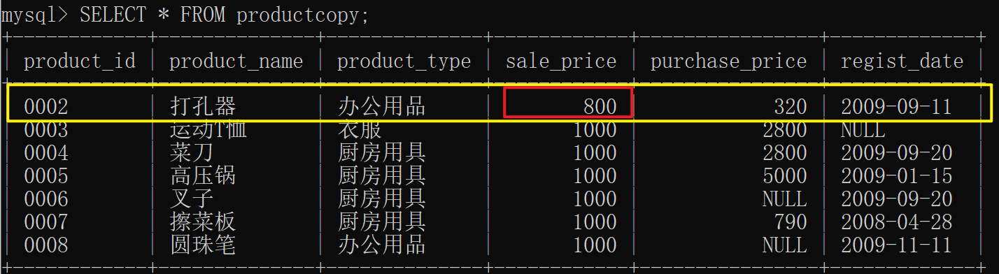
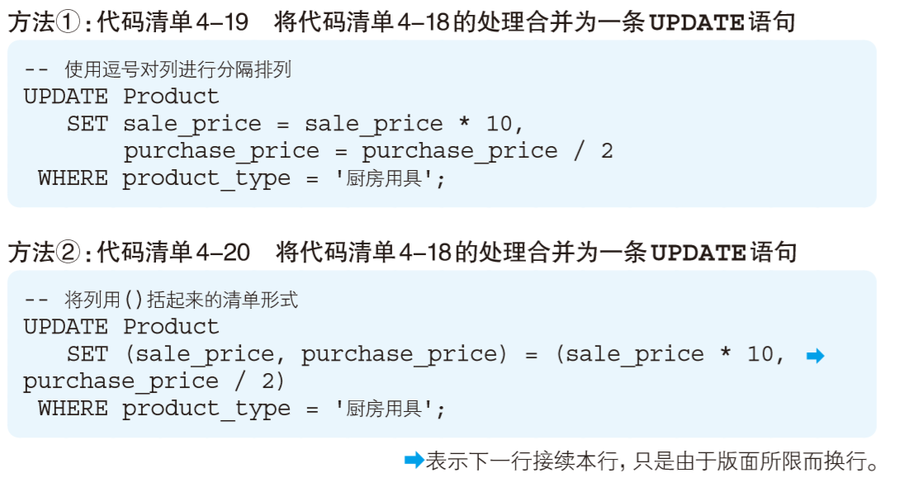

# 1 数据插入（INSERT）

## ★1.1 指定列名的插入一行数据 语法格式：

```mysql
INSERT INTO <表名> (列1, 列2, 列3, ……) VALUES (值1, 值2, 值3, ……);
```
## ★1.2 指定列名的插入多行数据 语法格式：
```mysql
INSERT INTO <表名> (列1, 列2, 列3, ……) VALUES 
(值1, 值2, 值3, ……),
(值1, 值2, 值3, ……),
……,
(值1, 值2, 值3, ……);
```
## ★1.3 不指定列名插入单行
```mysql
INSERT INTO <表名> VALUES (值1, 值2, 值3, ……);
```
## ★1.4 不指定列名插入多行
```mysql
INSERT INTO <表名> VALUES 
(值1, 值2, 值3, ……),
(值1, 值2, 值3, ……),
……,
(值1, 值2, 值3, ……);
```
## 1.5 默认值约束



显式插入：



隐式插入：



# 2 数据删除（DELETE）

## 2.1 删除表语法格式：

```mysql
DROP TABLE 表名;
```

## 2.2 删除所有数据语法格式：

```mysql
DELETE FROM <表名>;
```
等同于：

```mysql
DELETE FROM <表名> WHERE TRUE;
```

## 2.3 删除特定数据的语法格式：

```mysql
DELETE FROM <表名> WHERE <条件>;
```

**例程：**删除表productcopy中产品名称为“T恤”的记录。

```mysql
DELETE FROM productcopy WHERE product_name = 'T恤';
```


# 3 数据更新（数据的修改UPDATE）

## 3.1 修改表中所有数据语法格式：

```mysql
UPDATE <表名> 
	SET <列名> = <表达式>;
```



例程：把product_copy表中，售价更改为1000元。

```mysql
UPDATE productcopy 
	SET sale_price = 1000;
```

等同于：
```mysql
UPDATE productcopy 
	SET sale_price = 1000
	WHERE TRUE;
```

执行结果：



## 3.2 修改特定数据语法格式：

```mysql
UPDATE <表名> 
	SET <列名> = <表达式> WHERE <条件>;
```

例程：将表productcopy中打孔器的售价修改为800；
```mysql
UPDATE productcopy 
	SET sale_price = 800 WHERE product_name = '打孔器';
```



## 3.3 修改多列语法格式：


```mysql
UPDATE <表名> 
	SET <列名> = <表达式>,<列名> = <表达式>,……,
WHERE <条件>;
```

例程：

