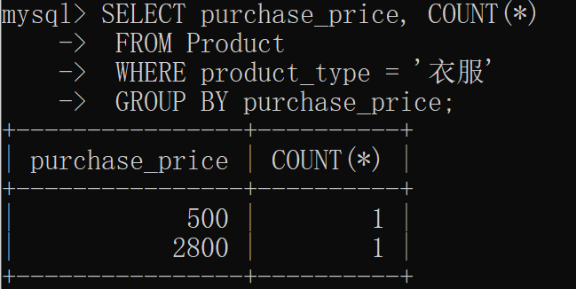

# 1 聚合

## 1.1 COUNT 计数

**COUNT(*) ：统计表中记录的行数。**

 [CreateTableProduct.sql](img\CreateTableProduct.sql) 


**例题：统计product表中记录的条数。**

**代码：**

```mysql
SELECT COUNT(*) FROM product;
```

**结果：**


**COUNT(列名/字段名/属性)：统计记录中列名/字段名/属性的数量。** **NULL不计入**。

例题：统计售价信息的数量。

```mysql
 SELECT COUNT(purchase_price) AS "记录数" FROM product;
```

结果：


分析：purchase_price列中，有两个NULL，未计入。

## 1.2 SUM 求和

```mysql
SELECT SUM(sale_price) FROM Product;
```


注意：SUM运算时，会**先剔除NULL值再求和**。

## 1.3 AVG 平均值

```mysql
SELECT AVG(sale_price), AVG(purchase_price)  FROM Product;
```


注意：AVG运算时，会**先剔除NULL值再求均值。

## 1.4 MAX/MIN 最值

例题：计算销售单价的最大值和进货单价的最小值 

```mysql
SELECT MAX(sale_price), MIN(purchase_price)  FROM Product;
```


 注意：MAX/MIN 函数原则上可以适用 于任何数据类型的列。可以对日期进行运算。

# 2 分组 (GROUP BY)

## 2.1 GROUP BY 子句

语法格式：

```mysql
SELECT <列名1>,<列名2>,<列名3>,……
FROM <表名> GROUP BY <列名1>,<列名2>,<列名3>,……;
```

**例题：按照商品种类统计数量**

代码：

```mysql
SELECT product_type, COUNT(*) 
FROM Product 
GROUP BY product_type;
```


分析：

GROUP BY将product表按照商品类型进行分组，然后对分组内进行COUNT(*)计数。


**★ 书写顺序(不能改变书写顺序) 1.	SELECT  ->  2.	FROM  ->  3.	WHERE  ->  4.	GROUP BY**

★ **执行顺序** **FROM  ->  WHERE  ->  GROUP BY  ->  SELECT**

GROUP BY 子句将NULL作为一个值

## 2.2 带WHERE子句的GROUP BY

代码：

```mysql
SELECT purchase_price, COUNT(*) 
 FROM Product 
 WHERE product_type = '衣服' 
 GROUP BY purchase_price;
```

执行顺序：

1 FROM  ->  2 WHERE  ->  3 GROUP BY  ->  4 SELECT

步骤1：从product表中取出所有数据


步骤2：将步骤1的结果使用WHERE子句进行筛选


步骤3：GROUP BY子句分组。由于价格进价只有两个不同的值，自然分为两个组。

步骤4：SELECT子句挑选显示的行进行显示。

