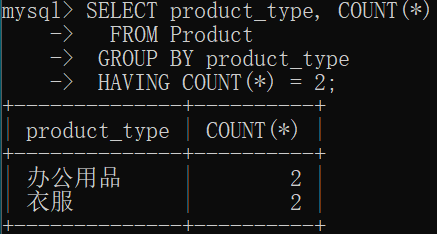

# 为分组指定条件（为聚合结果指定条件）

## 1 带WHERE子句的GROUP BY

语法格式：

```MYSQL
SELECT <列名1>,<列名2>,……,<列名n>
  FROM <表名> 
 WHERE 条件
 GROUP BY <列名1>, <列名2>,……,<列名n>;
```

例题：

```mysql
SELECT purchase_price, COUNT(*) 
  FROM product 
 WHERE product_type = '衣服' 
 GROUP BY purchase_price;
```

**执行顺序：FROM -> WHERE -> GROUP BY -> SELECT**

## 2 WHERE子句能不能使用聚合函数？

例题：对Product表中，对记录按照商品类型进行分类，筛选出统计数量为2的分组进行显示，显示商品类型和统计数量。

代码：

```MySQL
SELECT product_type, COUNT(*)  
  FROM Product 
 WHERE COUNT(*) = 2 
 GROUP BY product_type;
```

执行结果：


总结：**只有SELECT、HAVING、ORDER BY子句可以使用聚合函数。**

## 3 为聚合结果指定条件

**语法格式：**

```mysql
SELECT <列名1>, <列名2>, <列名3>, ……  
  FROM <表名> 
 GROUP BY <列名1>, <列名2>, <列名3>, …… 
 HAVING <分组结果对应的条件>
```

 **书写顺序**

**SELECT -> FROM -> WHERE -> GROUP BY -> HAVING**

例题：对Product表中，对记录按照商品类型进行分类，筛选出统计数量为2的分组进行显示，显示商品类型和统计数量。

代码更改为：
```MySQL
SELECT product_type, COUNT(*)  
  FROM Product 
 GROUP BY product_type
 HAVING COUNT(*) = 2;
```
执行结果：




## 4 HAVING子句的构成要素

**HAVING子句**和含有GROUP BY子句的**SELCET子句**一样，能使用的**要素**有三种。

- **常数**
- **聚合函数**
- **GROUP BY子句中指定的列名**

## 5 WHERE子句和HAVING子句的区别

1 HAVING子句 = 指定“组”的条件。

2 WHERE子句 = 指定“行”的条件。

3 相同结果下，执行效率WHERE子句高于HAVING子句。

